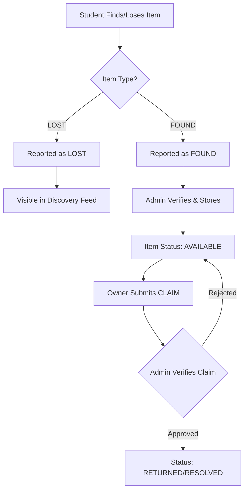

# REC LostLink - Core System Logic 🧠

Welcome to the internal logic documentation for **REC LostLink**. This guide is designed to help developers, administrators, and new contributors understand the underlying workflows, data structures, and state transitions that power the ecosystem.

---

## 🌊 1. High-Level Workflow
The core purpose of REC LostLink is to manage the lifecycle of an item from being "Lost" or "Found" to its eventual "Resolution" (returned to owner).

### The Item Lifecycle

---

## 🔐 2. User Roles & Access Control
The system operates with two primary roles, each with distinct capabilities:

| Feature | Student (USER) | Administrator (ADMIN) |
| :--- | :---: | :---: |
| Report Lost Item | ✅ | ✅ |
| Report Found Item | ✅ | ✅ |
| View Found Items Feed | ✅ | ✅ |
| Submit Claim Request | ✅ | ❌ |
| Verify/Approve Claims | ❌ | ✅ |
| Manage Inventory | ❌ | ✅ |
| View Analytics | ❌ | ✅ |
| Update Item Status | ❌ | ✅ |

---

## 📊 3. Data Architecture (Logic Entities)

### Items (`items` collection)
The heart of the system. Every object tracked is an "Item".
- **Lost Items**: Created by owners. Status is typically `LOST`.
- **Found Items**: Created by finders. Status starts as `OPEN` and moves to `AVAILABLE` once an admin takes possession.
- **Admin Metadata**: Admins add `storage_location` (e.g., "Shelf 4B") and `admin_remarks` to found items.

### Claims (`claims` collection)
A claim is a request from a user to prove ownership of a found item.
- **Proof Logic**: Users can upload a `proof_image_url` or provide `verification_details` (e.g., "The phone has a cracked screen and a blue cover").
- **States**: `PENDING` ➔ `APPROVED` or `REJECTED`.

---

## ⚙️ 4. Backend Logic (FastAPI)

### Authentication Flow
1. **Login**: User provides credentials.
2. **JWT Generation**: Backend verifies and returns a JSON Web Token.
3. **Protected Routes**: Every subsequent request includes the JWT in the `Authorization` header.
4. **Dependency Injection**: The `get_current_user` dependency extracts the user ID and role, ensuring only Admins can access `/admin/*` routes.

### Image Handling Logic
1. User uploads an image via the Mobile App or Admin Dashboard.
2. The Backend saves the file in `fastapi-backend/static/uploads/`.
3. The Backend returns a public URL formatted as `http://<server-ip>:8080/static/uploads/<filename>`.
4. This URL is stored in the database for rendering across all platforms.

---

## 🏛️ 5. Admin Verification Logic
When a student reports a **FOUND** item:
1. It appears in the Admin Dashboard "Inventory".
2. Admin reviews the report, assigns a physical storage location, and marks it as **AVAILABLE**.
3. When a **CLAIM** arrives:
   - Admin compares the student's "Proof Details" against the physical item.
   - If satisfied, Admin clicks **APPROVE**.
   - **Trigger**: Upon approval, the Item status automatically updates to `RESOLVED`, and the claim status updates to `APPROVED`.

---

## 📱 6. Discovery Logic (Search & Filter)
The system uses a simple but effective filtering logic:
- **Category Filter**: Filter items by type (Electronics, Documents, Wallets, etc.).
- **Search Logic**: Case-insensitive search across `category` and `description` fields.
- **Chronological Sorting**: Newer reports are always shown first to ensure fast recovery of items.

---

## 🚀 7. Technical Implementation Summary
- **Database**: MongoDB (NoSQL) allows for flexible item schemas (some items have more metadata than others).
- **Frontend State**: The Mobile App uses React Context to maintain the login state and user profile globally.
- **Real-time feel**: FastAPI's asynchronous nature allows the mobile app to feel snappy even during image uploads.

---

*This document is maintained by the REC LostLink Development Team. For technical inquiries, refer to the [API Documentation](http://localhost:8080/docs).*

---
> [!IMPORTANT]
> **Disclaimer**: This project is developed by a student of Rajalakshmi Engineering College as part of the **Design Thinking and Innovation (DTI)** academic coursework.
>
> This application is a student initiative and is **not** an official product of the college. It has been created solely for educational, research, and prototype purposes.
>
> Any future real-world deployment within the campus will be subject to formal approval and authorization from the college administration.
>
> The project does not claim ownership of institutional processes, branding, or authority and is intended only to demonstrate an innovative solution to a campus problem.

