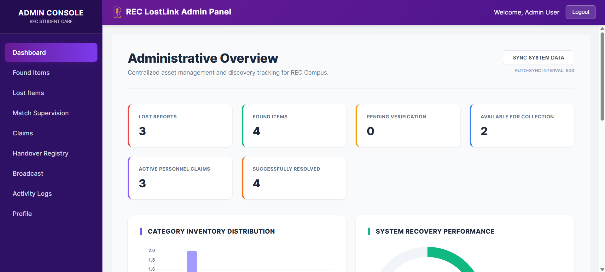

# REC LostLink 🔍

Digitalizing the Lost & Found Ecosystem at Rajalakshmi Engineering College.

 [](https://opensource.org/licenses/MIT)

## Overview
**REC LostLink** is a streamlined solution that drastically simplifies the lost and found reporting and claiming process within the REC campus. It offers a secure and centralized platform built to replace traditional manual tracking with modern efficiency.

> **Disclaimer**: This student-developed project is a prototype created for educational purposes and is not yet an official product of the college.

## Gallery

<table width="100%">
  <tr>
    <td align="center" valign="top" width="33.33%">
      <b>Home</b><br><sub>App overview</sub><br>
      
    </td>
    <td align="center" valign="top" width="33.33%">
      <b>Report Item</b><br><sub>Lost & Found Forms</sub><br>
      &nbsp;│&nbsp;
    </td>
    <td align="center" valign="top" width="33.33%">
      <b>My Activity</b><br><sub>Tracking Status</sub><br>
      &nbsp;│&nbsp;
    </td>
  </tr>
  <tr>
    <td align="center" valign="top" width="33.33%">
      <b>Admin Panel</b><br><sub>Management</sub><br>
      
    </td>
    <td align="center" valign="top" width="33.33%">
      <b>Splash Screen</b><br><sub>Branding</sub><br>
      
    </td>
    <td align="center" valign="top" width="33.33%">
      <b>Login</b><br><sub>Auth Screen</sub><br>
      &nbsp;│&nbsp;
    </td>
  </tr>
</table>


## 🛠 Features & Tech Stack
- **Backend (Python)**: High-performance API using **FastAPI**, with **MongoDB** for flexible data storage.
- **Admin Portal (Web)**: A modern **React** dashboard for campus admins to manage inventory and verify claims.
- **Mobile App (Expo Go)**: A reliable **React Native** app allowing students to instantly report lost or found items with image evidence.

## Quick Start Guide

You can launch the complete ecosystem with our automated setup script on Windows!

### 1. Requirements

- [Node.js](https://nodejs.org/) (v18+)
- [Python](https://www.python.org/downloads/) (3.12+)
- MongoDB Community Edition running locally (Port 27017)
- Expo Go App on your mobile device

### 2. Automated Setup (Windows)

1. **Clone the Project**:
   ```bash
   git clone https://github.com/GIRIDHAR-U-47/LostLink-REC.git
   cd LostLink-REC
   ```
2. **Run Installer**:
   Double-click the `setup_and_run.bat` file or run it in your terminal. This simple script will safely install all backend and frontend dependencies!

### 3. Launching

After the setup script finishes, run each service in a separate terminal:

**Terminal 1:** Start the Backend
```bash
cd fastapi-backend
venv\Scripts\activate
uvicorn main:app --reload --host 0.0.0.0 --port 8080
```

**Terminal 2:** Start Admin Dashboard
```bash
cd admin-dashboard
npm start
```
*(The dashboard natively runs on http://localhost:3000)*

**Terminal 3:** Start Mobile App
```bash
cd frontend
npm start
```
*❗ Very Important: To use the mobile app on a real device, open `frontend/src/services/api.js` and change `localhost` in the `BASE_URL` to your real WiFi IPv4 address, e.g., `http://192.168.1.10:8080/api`.*

## Demo Access

**Roles** | **Email** | **Password**
--- | --- | ---
**Administrator** | `admin@rec.edu.in` | `admin123`
**Student** | `giri@rec.edu.in` | `student123`
**Student** | `sai@rec.edu.in` | `student123`

## Quick Troubleshooting

- **Server Connection Failed?** Verify that your computer and mobile device are connected to the same Wi-Fi. Ensure the `BASE_URL` points directly to your PC's IP.
- **Login Bug?** Delete `fastapi-backend/venv` and reinstall manually. Some bcrypt versions can clash.
- **Database Missing?** Make sure MongoDB is active via `mongod` command on your system.

## 🤝 Community & License

- [Review our Code of Conduct](./CODE_OF_CONDUCT.md)
- [View detailed System Logic & Workflows](./LOGIC.md)
- [How to Contribute](./CONTRIBUTING.md)
- Licensed under the **MIT License**. Check out [LICENSE](./LICENSE) for details.
