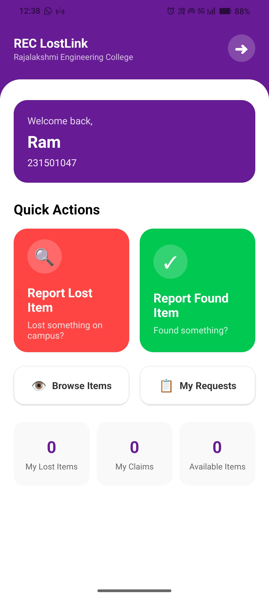
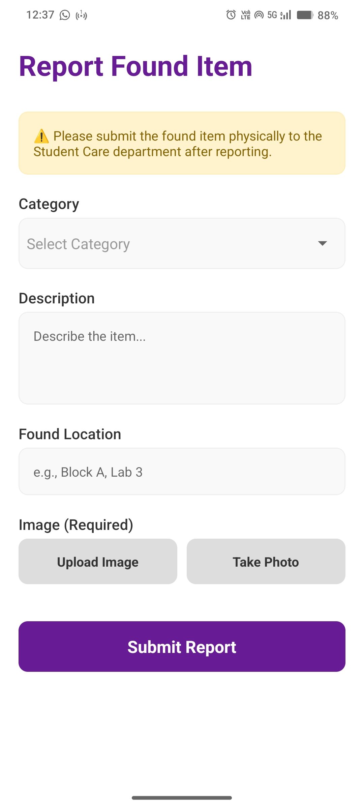
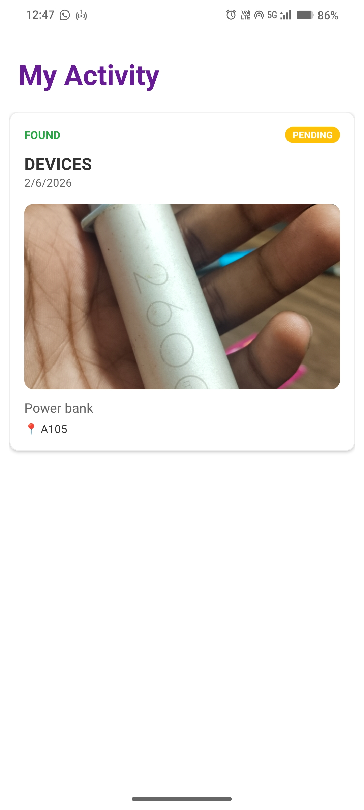
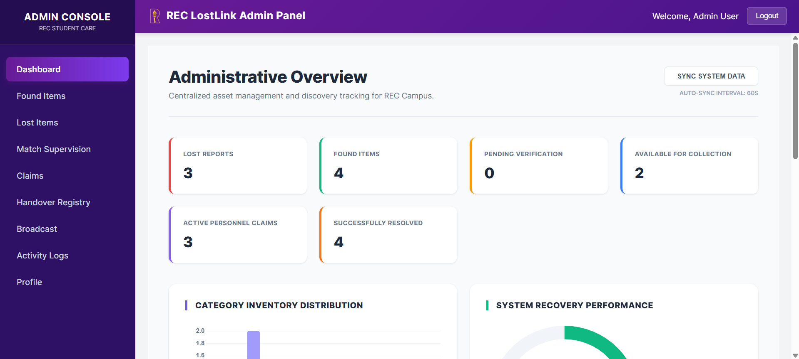
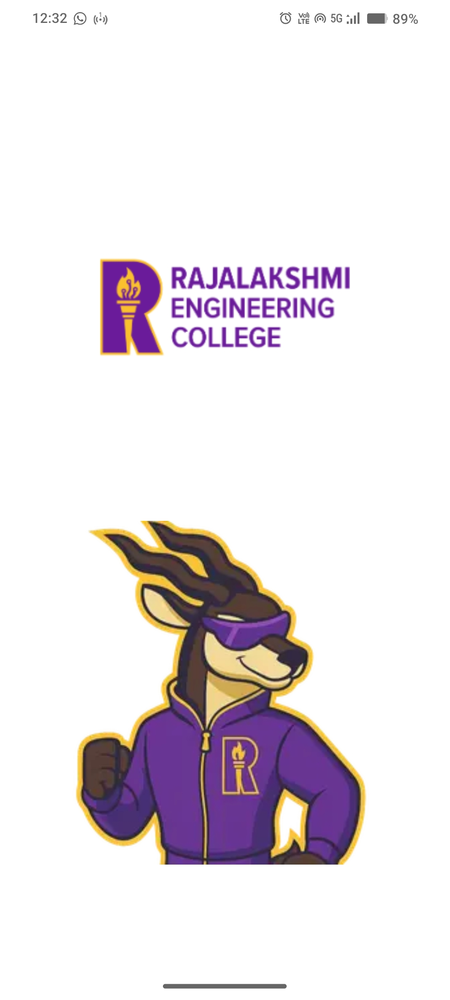
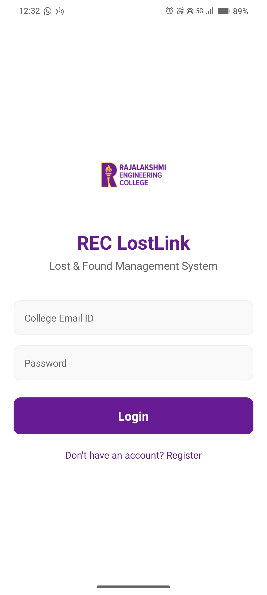
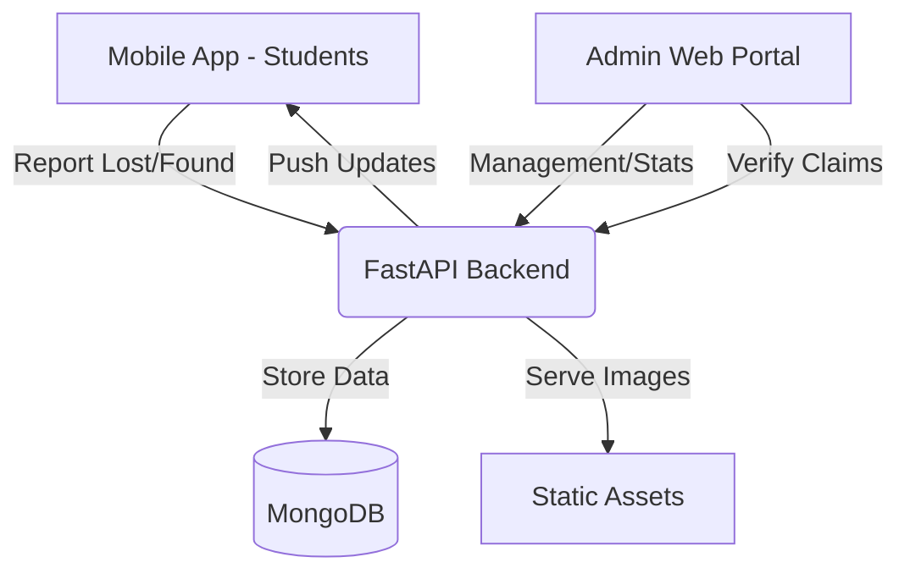

<div align="center">

# 🔍 REC LostLink
### *Digitalizing the Lost & Found Ecosystem at Rajalakshmi Engineering College*

[](https://github.com/GIRIDHAR-U-47/LostLink-REC/stargazers)
[](https://opensource.org/licenses/MIT)
[](https://fastapi.tiangolo.com/)
[](https://reactnative.dev/)
[](https://www.mongodb.com/)

[**Explore Docs**](./docs) • [**Report Bug**](https://github.com/GIRIDHAR-U-47/LostLink-REC/issues) • [**Request Feature**](https://github.com/GIRIDHAR-U-47/LostLink-REC/issues)

</div>

---

## 📖 Introduction

**REC LostLink** is a comprehensive, centralized solution designed to modernize the way lost and found items are handled within the REC campus. Moving away from manual logbooks, LostLink provides a secure, real-time platform for students to report lost items and for staff to manage found inventory with cryptographic verification.

> [!IMPORTANT]
> **Disclaimer**: This is a student-developed prototype for educational purposes. It serves as a proof-of-concept for digitalizing campus operations.

---

## 🎨 Gallery

<table width="100%">
  <tr>
    <td align="center" width="33%">
      <b>🏠 Home & Overview</b><br>
      
    </td>
    <td align="center" width="33%">
      <b>📝 Report Entry</b><br>
      
    </td>
    <td align="center" width="33%">
      <b>📊 Tracking Status</b><br>
      
    </td>
  </tr>
  <tr>
    <td align="center">
      <b>🛡️ Admin Dashboard</b><br>
      
    </td>
    <td align="center">
      <b>✨ Splash Branding</b><br>
      
    </td>
    <td align="center">
      <b>🔐 Secure Auth</b><br>
      
    </td>
  </tr>
</table>

---

## 🛠 Tech Stack

| Component | technologies |
| :--- | :--- |
| **Backend** |    |
| **Mobile App** |   |
| **Admin Web** |   |
| **Infrastructure** |   |

---

## 🏗 System Architecture


```mermaid
graph TD
    A[Mobile App - Students] -->|Report Lost/Found| B(FastAPI Backend)
    C[Admin Web Portal] -->|Management/Stats| B
    B -->|Store Data| D[(MongoDB)]
    B -->|Serve Images| E[Static Assets]
    C -->|Verify Claims| B
    B -->|Push Updates| A
```

---

## 📂 Project Structure

```bash
LostLink-REC/
├── admin-dashboard/     # React web portal for administrators
├── fastapi-backend/     # Python FastAPI server & logic
├── frontend/            # React Native (Expo) mobile application
├── docs/                # Documentation & assets
│   └── assets/          # Application screenshots & banners
├── CONTRIBUTING.md      # Development guidelines
├── LOGIC.md             # Core business logic workflows
└── setup_and_run.bat    # Automated Windows installer
```

---

## 🚀 Getting Started

### 📋 Prerequisites
- **Node.js**: v18 or newer
- **Python**: v3.12 or newer
- **MongoDB**: Community Edition (Running on :27017)
- **Expo Go**: Installed on your mobile device for testing

### ⚡ Automated Setup (Recommended)
We provide a one-click setup script for Windows users:
1. Clone the repository:
   ```bash
   git clone https://github.com/GIRIDHAR-U-47/LostLink-REC.git
   cd LostLink-REC
   ```
2. Run the established environment:
   Double-click `setup_and_run.bat`. This will create virtual environments and install all dependencies for both frontend and backend.

### 🛠 Manual Launch
If you prefer manual control, launch these in separate terminals:

**Terminal 1: Backend**
```bash
cd fastapi-backend
source venv/bin/activate  # or venv\Scripts\activate on Windows
uvicorn main:app --reload --host 0.0.0.0 --port 8080
```

**Terminal 2: Admin Dashboard**
```bash
cd admin-dashboard
npm start
```

**Terminal 3: Mobile App**
```bash
cd frontend
npm start
```

---

## 🔑 Demo Access

| Role | Username | Password |
| :--- | :--- | :--- |
| **Administrator** | `admin@rec.edu.in` | `admin123` |
| **Student (Giri)** | `giri@rec.edu.in` | `student123` |
| **Student (Sai)** | `sai@rec.edu.in` | `student123` |

---

## 📡 API Reference

The backend provides an interactive Swagger UI for testing endpoints:
- **Local URL**: `http://localhost:8080/docs`
- **Alternative (ReDoc)**: `http://localhost:8080/redoc`

---

## 🤝 Contributing & Support

Contributions are what make the open-source community an amazing place to learn, inspire, and create. Any contributions you make are **greatly appreciated**.

1. Fork the Project
2. Create your Feature Branch (`git checkout -b feature/AmazingFeature`)
3. Commit your Changes (`git commit -m 'Add some AmazingFeature'`)
4. Push to the Branch (`git checkout origin feature/AmazingFeature`)
5. Open a Pull Request

---

## 📜 License & Community

- [CODE_OF_CONDUCT.md](./CODE_OF_CONDUCT.md)
- [SECURITY.md](./SECURITY.md)
- [CONTRIBUTING.md](./CONTRIBUTING.md)

Distributed under the MIT License. See [LICENSE](./LICENSE) for more information.

<p align="right">(<a href="#top">back to top</a>)</p>


